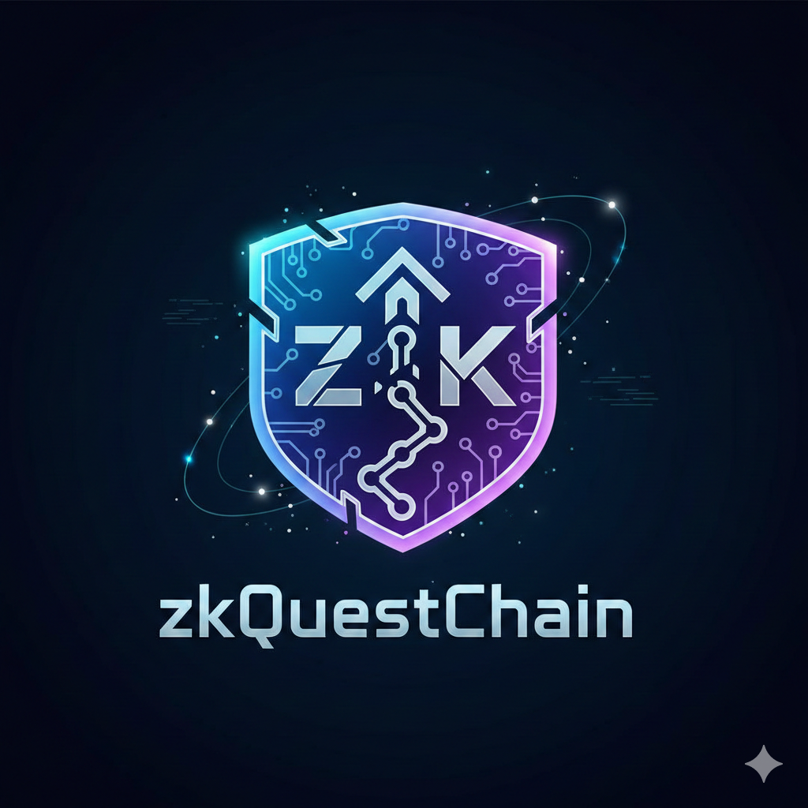

<div align="center">
  
  
# zkQuestChain MVP (Stellar Hacks: ZK Gaming)

🎉 **MVP DEPLOYED ON STELLAR TESTNET!**

Educational onchain gaming platform where users prove quest completion (Sudoku) via ZK proofs verified on Soroban, minting Achievement SBTs.
</div>

**Status**: ✅ **FULLY DEPLOYED & OPERATIONAL** - All contracts active, Frontend running, ZK system live (Feb 22, 2026)

## 🎮 Live Interface Preview


*Screenshot: Interactive Sudoku Fortress #2 quest interface with profile tracking and progress management*

## 🚀 Quick Start

```bash
# 1. Clone and install dependencies
cd frontend && npm install

# 2. Start the frontend
npm run dev

# 3. Open http://localhost:5176/ (port may vary if 5175 is busy)
# 4. Connect Freighter wallet (Testnet)
# 5. Solve Sudoku and submit ZK proof!
# 6. Watch transaction execute on blockchain
```

## 📁 Structure

- `contracts/` — Soroban Contracts (Rust) - 4 deployed contracts
- `circuits/` — Noir Circuits (Sudoku ZK validator)
- `frontend/` — React + Vite + Tailwind dApp
- `scripts/` — Build and deploy automation
- `docs/` — Technical documentation

## 🌐 Deployed Contracts (Testnet)

| Contract | ID |
|----------|----|
| QuestManager | `CAYLKAVMTQPLJ3Q34YR4MSKOUXYFQMOGWQVPKFUKTWHGGHUQNQJIMBAK` |
| PlayerRegistry | `CBK3I5AAAIJ6WT7YGEIKVQULY2TGKVL3UMXGC4KD5M4YQPA23RSEPV3O` |
| AchievementNFT | `CDQ3D4U64NZ7N4GNNLBSUQ55ZRSDNVK3ROJNPNJAZL4JLLC3DVKQTEKG` |
| UltraHonkVerifier | `CDMAU7PE5DFPORYS4OPCS34O4EVDJNO7X2WIXPNLNFVQYHE376FM76DB` |

See all links in [CONTRACT_IDS.md](CONTRACT_IDS.md)

## 💻 Requirements

- Node.js 20+
- Rust + cargo (to compile contracts)
- Soroban CLI v25+ (stellar-cli)
- Noir (nargo) for circuits
- Freighter Wallet

## 🎯 Testing (Testnet)

### 1. Configure Freighter Wallet

```bash
# Install Freighter extension
# Chrome: https://chrome.google.com/webstore/detail/freighter/bcacfldlkkdogcmkkibnjlakofdplcbk

# Configure for Testnet:
# Freighter → Settings → Network → Testnet
```

### 2. Get Test XLM

```bash
# Copy your Freighter address and paste below
curl -X POST "https://friendbot.stellar.org?addr=YOUR_ADDRESS_HERE"
```

### Demo Mode (No Wallet Required)

```bash
# Edit frontend/.env
VITE_DEMO_MODE=true

# Reload browser - now you can test without a wallet!
# All transactions will be simulated locally
```

### 3. Run the Frontend

```bash
cd frontend
npm install
npm run dev
# Frontend opens at http://localhost:5176/
```

### 4. Test in Browser

1. Open http://localhost:5176/
2. Click "Conectar Cargueiro" (Connect Wallet)
3. Connect your Freighter wallet (Testnet)
4. Verify you're on **Testnet**
5. Solve the Sudoku puzzle
6. Click "Apresentar comprovante" (Submit Proof)
7. Approve in Freighter
8. View the transaction on explorer!

## 🎮 Available Quests

### Quest #1: Fortaleza do Sudoku #1
- **Difficulty**: Easy ⭐
- **Reward**: 100 XP
- **Status**: ✅ Available
- **Solution**: Provided in [SUDOKU_SOLUTIONS.md](SUDOKU_SOLUTIONS.md)

### Quest #2: Fortaleza do Sudoku #2
- **Difficulty**: Medium ⭐⭐
- **Reward**: 150 XP
- **Status**: ✅ Available
- **Solution**: **VERIFIED & OPTIMIZED** in [SUDOKU_SOLUTIONS.md](SUDOKU_SOLUTIONS.md)

### Quest #3: Fortaleza do Sudoku #3
- **Difficulty**: Hard ⭐⭐⭐
- **Reward**: 200 XP
- **Status**: ✅ Available
- **Solution**: Provided in [SUDOKU_SOLUTIONS.md](SUDOKU_SOLUTIONS.md)

**Total Maximum XP**: 450 XP

## 🛠️ For Developers

### Compile Contracts

```bash
cd contracts
RUSTFLAGS='-C link-arg=-s -C target-feature=-reference-types' \
  cargo build --release --target wasm32-unknown-unknown

# Optimize WASMs
soroban contract optimize --wasm target/wasm32-unknown-unknown/release/quest_manager.wasm
```

### Compile Noir Circuit

```bash
cd circuits/sudoku
nargo compile

# Copy ACIR to frontend
./scripts/build_circuit.sh
```

### Deploy New Contracts

```bash
# Configure identity
soroban keys generate mykey --network testnet

# Fund account
curl -X POST "https://friendbot.stellar.org?addr=$(soroban keys address mykey)"

# Automated deployment
./scripts/deploy_all_contracts.sh
```

## 📚 Complete Documentation

### Quick Navigation
- **[QUICK_START.md](QUICK_START.md)** - 5-minute setup guide
- **[SUDOKU_SOLUTIONS.md](SUDOKU_SOLUTIONS.md)** - All quest solutions (Quest #2 verified ✅)
- **[SYSTEM_STATUS.md](SYSTEM_STATUS.md)** - Live system health 🟢
- **[RELEASE_NOTES.md](RELEASE_NOTES.md)** - v1.0.0 Release notes

### Developers
- **[DEPLOY_INSTRUCTIONS.md](DEPLOY_INSTRUCTIONS.md)** - Detailed deployment
- **[docs/ARCHITECTURE_SUMMARY.md](docs/ARCHITECTURE_SUMMARY.md)** - System architecture
- **[docs/API.md](docs/API.md)** - Contract API reference

### Support
- **[FAQ.md](FAQ.md)** - Frequently asked questions  
- **[TROUBLESHOOTING.md](TROUBLESHOOTING.md)** - Problem solving
- **[STATUS_FINAL.md](STATUS_FINAL.md)** - Project status & limitations
- **[DOCUMENTATION_INDEX.md](DOCUMENTATION_INDEX.md)** - Complete documentation index

## 📌 Current Status (February 22, 2026)

✅ **All Core Features Working**
- Frontend fully functional and running
- 4 contracts deployed and active on Testnet
- ZK proof generation working
- Progress tracking functional
- Sudoku solutions verified

## ⚠️ MVP Limitations

1. **Cross-contract calls** replaced with logs (SDK incompatibility)
2. **On-chain verification** is stub (accepts all proofs in MVP)
3. **Quest creation** via CLI only (not in UI)
4. **Multiplayer** - Single-player only
5. **Mainnet** - Testnet only (future deployment)

> These limitations are intentional for MVP. Full features in v1.1+

## 💾 Local Progress System

The frontend uses **browser localStorage** to track:
- **XP Points** - Earned from completing quests
- **Player Level** - Calculated from XP (Level = √(XP/100))
- **Achievements** - Quest completion markers
- **Current Quest Position** - Which Sudoku you're on

This works **even without a connected wallet**. Progress updates automatically:
```
Complete Quest #1 (Easy) → +100 XP, Level 1
Complete Quest #2 (Medium) → +150 XP, Level 1
Complete Quest #3 (Hard) → +200 XP, Level 2

Total: 450 XP possible
```

When you connect a wallet later, you can submit real proofs to the blockchain to record your achievements on-chain.

## ✨ Features

- ✅ **ZK Sudoku Proofs** - Zero-knowledge proofs without revealing solution
- ✅ **3 Difficulty Levels** - Easy, Medium, Hard (100-200 XP rewards)
- ✅ **Player Profiles** - XP, Levels, Achievements tracking
- ✅ **Local Progress** - Auto-save progress in browser
- ✅ **Soroban Integration** - 4 smart contracts on Testnet
- ✅ **SBT Achievements** - Soulbound achievement NFTs
- ✅ **Wallet Support** - Freighter wallet integration
- ✅ **Network Switcher** - Testnet/Futurenet toggle
- ✅ **Real-time Feedback** - Transaction hashes and explorer links
- ✅ **Demo Mode** - No wallet required (VITE_DEMO_MODE=true)

## 🏗️ Tech Stack

### Frontend
- React 18 + TypeScript
- Vite 5 (fast bundling)
- Tailwind CSS (styling)
- Stellar SDK + Freighter (wallet)
- Noir.js + Barretenberg (ZK proofs)

### Smart Contracts (Rust)
- Soroban SDK v22
- 4 optimized contracts:
  - **QuestManager** (15KB) - Quest management
  - **PlayerRegistry** (9KB) - Player profiles
  - **AchievementNFT** (9KB) - SBT minting
  - **UltraHonkVerifier** (503B) - Proof verification

### ZK Circuits
- Noir v0.36.0 language
- Sudoku validator (81KB compiled)
- UltraHonk proof system
- Browser-compatible WASM

### Infrastructure
- **Blockchain**: Stellar Testnet
- **Contracts**: Soroban (native Stellar)
- **Frontend**: Vite + Node.js
- **Explorer**: Stellar Expert
- **Wallet**: Freighter extension

## 🎮 Play Now!

```
1️⃣  Start: npm run dev
2️⃣  Browse: http://localhost:5176/
3️⃣  Connect: Freighter wallet
4️⃣  Solve: Sudoku puzzle
5️⃣  Prove: Generate ZK proof
6️⃣  Submit: Push to blockchain
7️⃣  Verify: Check on Stellar Expert
```

## 📈 Project Timeline

- **Feb 17, 2026**: 🚀 MVP launched on Stellar Testnet
- **Feb 22, 2026**: ✅ All documentation updated, Quest #2 verified
- **Feb 25, 2026**: 👥 Community testing phase
- **Mar 1, 2026**: 🎯 v1.1 features (cross-contract calls, leaderboard)
- **Q2 2026**: 🌍 Mainnet deployment

## 🤝 Contributing

Pull requests welcome! For major changes:
1. Open an issue first
2. Follow the current code style
3. Update documentation
4. Test thoroughly

## 📝 License

MIT License - See [LICENSE](LICENSE) for details

## 🏆 Stellar Hacks Hackathon

Built for **Stellar Hacks: ZK Gaming Challenge**

- **Challenge**: Build ZK game on Stellar
- **Status**: ✅ MVP Complete
- **Network**: Testnet
- **Deploy Date**: February 17, 2026
- **Current Status**: 🟢 All Systems Operational

---

**Made with ❤️ using Stellar, Soroban & Noir**

**Need help?** → See [QUICK_START.md](QUICK_START.md) or [FAQ.md](FAQ.md)  
**Want details?** → Check [DOCUMENTATION_INDEX.md](DOCUMENTATION_INDEX.md)  
**Have bugs?** → File an issue or check [TROUBLESHOOTING.md](TROUBLESHOOTING.md)
